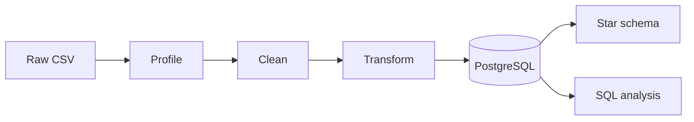

# UrbanNest Retail Pipeline

An end-to-end data pipeline that turns messy retail order data into a clean, analysis-ready PostgreSQL database, built with Python, Pandas and SQL.

UrbanNest sells through a website, mobile app, physical stores, marketplaces and Instagram. Each channel records data differently, so the raw data had missing values, inconsistent spellings, wrong data types and contradictory statuses. This project cleans and standardises it, adds useful metrics, loads it into PostgreSQL, models it as a star schema, and answers business questions with SQL.

## Workflow



## Tools
Python · Pandas · PostgreSQL · SQLAlchemy · Jupyter Notebook · Git and GitHub

## Project structure
```
urbannest-retail-pipeline/
├── data/
│   ├── raw/                 # original CSV (never edited)
│   └── processed/           # cleaned output (created by the notebooks)
├── notebooks/
│   ├── profiling.ipynb      # explore and clean the data
│   ├── transformation.ipynb # add metrics and load into PostgreSQL
│   └── analysis.ipynb       # run the SQL analysis
├── sql/
│   ├── 02_star_schema.sql   # builds the star schema
│   └── 03_analysis.sql      # business questions in SQL
├── docs/
│   └── data_quality_report.md
├── src/
│   └── check_connection.py  # tests the database connection
├── requirements.txt
└── .env.example
```

## How to run
1. Install PostgreSQL, then create the user and database:
```sql
   CREATE ROLE urbannest WITH LOGIN PASSWORD 'your_password';
   CREATE DATABASE urbannest OWNER urbannest;
```
2. Install the Python libraries: `pip install -r requirements.txt`
3. Copy `.env.example` to `.env` and add your password.
4. Run the notebooks in order: `profiling` → `transformation` → `analysis`.
5. Build the star schema by running `sql/02_star_schema.sql` in PostgreSQL (for example in pgAdmin's Query Tool).

## Data quality
The raw data (5,000 orders, 25 columns) had these problems. Full details are in [docs/data_quality_report.md](docs/data_quality_report.md).

- Missing values in 10 columns, filled with "Unknown" for text; numbers left empty
- The same value spelled many ways (e.g. gender: Male, M, male, MALE, " m "), standardised with mapping dictionaries
- Extra spaces, removed
- Dates stored as text, converted with `pd.to_datetime()`
- Contradictory statuses (e.g. 443 cancelled orders marked "delivered"), kept and flagged
- No rows were deleted: 5,000 rows in, 5,000 rows out

## Key findings
- Revenue rose from ₦72.4M (2024) to ₦82.9M (2025). 2026 covers January to August only.
- Electronics is the top category (₦37.3M), but all six categories are close.
- Regular customers bring in the most revenue (₦72.5M).
- Website is the strongest channel (₦49.7M); Instagram is the weakest (₦23.3M).
- 589 of 5,000 orders were delayed.

## Data model


| Table | Rows | Holds |
|---|---|---|
| fact_order | 5,000 | One row per order: quantities, revenue, fees, statuses |
| dim_customer | 5,000 | Customer details |
| dim_product | 24 | Products, keyed by name because the original product_id was unreliable |
| dim_channel | 6 | Sales channels |
| dim_date | 970 | Calendar details for each order date |

The fact table has the same 5,000 orders and the same total revenue as the source table, so nothing was lost when building the model.

## Limitations
- Each customer appears only once, so repeat-purchase analysis isn't possible.
- The same product ID is used for different products, so products are grouped by name.
- 2026 is a partial year, so it can't be compared directly with full years.

## Author
GLICON · [GitHub](https://github.com/GLICON)
